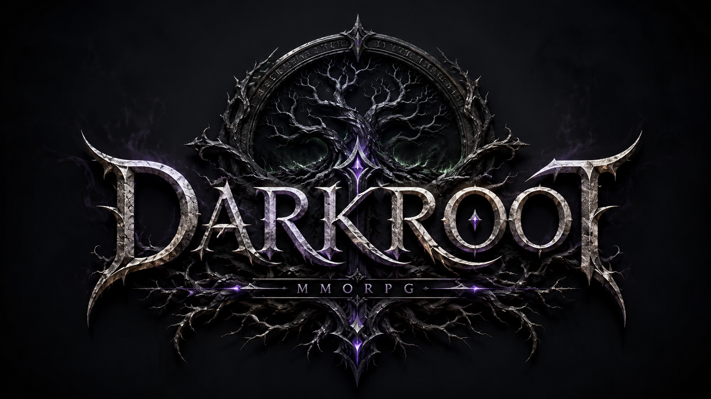

<p align="center">
  
</p>

# Blackroot

**A dark-fantasy browser RPG built with HTML5 Canvas and modular JavaScript.**# Blackroot

**Blackroot** is a dark-fantasy browser RPG built with HTML5 Canvas and modular JavaScript. It is inspired by classic MMORPG progression: character creation, class identity, party play, mercenary companions, loot, quests, professions, caves, dungeons, and hostile wilderness exploration.

Current reviewed build: **V0.16.68 — Party Mercenary Command Buttons Regression Fix**

## Overview

Blackroot drops the player into the haunted **Dark Woods**, a dangerous starting region built around survival, exploration, combat progression, and old-school RPG systems. Players create a character, choose a race and class, explore the world, fight monsters, complete quests, gather resources, collect gear, hire mercenaries, and push deeper into caves and dungeon routes.

The project is currently an active playable prototype / alpha. It focuses on building a full single-player RPG foundation with MMO-style systems running directly in the browser.

## Features

- **14 playable classes**: Paladin, Warden, Fighter, Rogue, Ranger, Assassin, Wizard, Shaman, Summoner, Necromancer, Cleric, Druid, Bard, and Enchanter.
- **4 playable races**: Human, Elf, Bogling, and Ratkin.
- **Class-based spellbooks** with 280 defined abilities across levels 1–20.
- **HTML5 Canvas gameplay runtime** with a modular JavaScript system architecture.
- **Dark Woods overworld** with procedural world generation, hostile mobs, NPCs, camps, caves, and resource nodes.
- **Mercenary and party systems** with companion HUDs, HP/mana bars, EXP tracking, and command stances.
- **Combat systems** including auto attack, spell casting, threat, status effects, projectiles, boss abilities, and enemy AI profiles.
- **Loot and equipment systems** with item rarity, stats, bags, paper-doll equipment, set-bonus support, vendors, bank/stash storage, and trading.
- **Quest, event, and dialogue systems** with quest chains, objectives, rewards, NPC interaction, and condition checks.
- **Professions and world activities** including gathering, crafting, fishing, swimming, resources, and terrain-based ambience.
- **Caves and dungeon content** including Silk Web Cavern, Blackroot Catacombs, Gloom’s Crypt concepts, bosses, puzzles, and elite encounters.
- **Custom game UI** with character creation, action bar, player HUD, spellbook, inventory, party window, map, settings, and patch notes.
- **Audio and ambience** including music loops, combat/town/cave ambience, footsteps, UI sounds, spell effects, weather, and environmental sound effects.
- **Local save support** with browser storage, account/character gates, character slots, migration handling, and export/import tooling.
- **Editor/dev tools** for world data, layered maps, NPCs, mobs, quests, spells, resources, dungeons, puzzles, and validation.

## Controls

| Action | Default Key |
|---|---:|
| Move | WASD |
| Click-to-walk | Mouse click |
| Jump / swim up | Space |
| Dive | U |
| Interact | E |
| Target nearest | Tab |
| Auto attack | 1 |
| Ability slots | 2–0 |
| Meditate | R |
| Bags | B |
| Character | C |
| Skills / professions | K |
| Map | M |
| Party | O |
| Quest log | L |
| Fishing | F |
| Crafting | J |
| Gather nearest | G |
| Pause | P |
| Fullscreen | F11 |

Controls can be rebound in-game through the Settings panel.

## Running the Game

No build step is required.

1. Download or clone the repository.
2. Open `Blackroot V0.16.68.html` in a modern desktop browser.
3. Create or load an account/character from the main menu.

For GitHub Pages, copy or rename the main HTML file to `index.html` so the page loads automatically.

## Project Structure

```text
core/             Shared runtime utilities, configuration, registry, stats, IDs, and globals
data/             Classes, races, spells, items, enemies, quests, dungeons, resources, and crafting data
entities/         Player, enemy, pet, mercenary, bot, and remote-player entity definitions
systems/          Gameplay systems: combat, UI, inventory, save/load, party, mercs, quests, editor, rendering backend, etc.
render/           Terrain, entity, effects, procedural model, minimap, and paper-doll renderers
assets/           Class art, spell icons, cursors, sprite manifests, high-poly model data, and effect geometry
music/            Ambient music loops
sound-effects/    UI, combat, environment, and gameplay sound effects
docs/             Patch notes, implementation notes, validation notes, and development history
tools/            Sprite baking/export and high-poly generation utilities
```

## Technical Notes

- Built as a static browser game using plain JavaScript, HTML, CSS, and Canvas.
- The reviewed package contains 194 JavaScript files; all passed `node --check` syntax validation.
- The runtime is modular but does not currently require npm, bundling, or a server.
- Some internal code/comments still use older `DreamRealms` namespace labels; the public project name is **Blackroot**.

## Development Status

Blackroot is under active development. The current focus is polishing the in-game UI, party/mercenary controls, action bar layout, spell icon integration, performance settings, and core gameplay loop stability.
